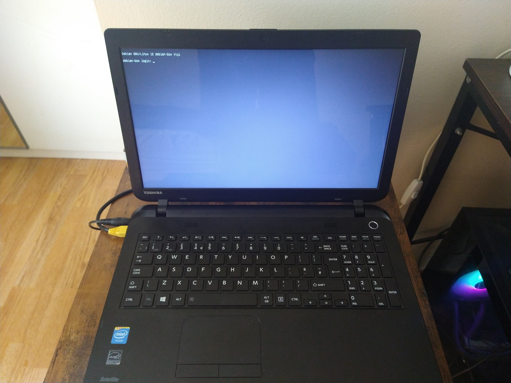
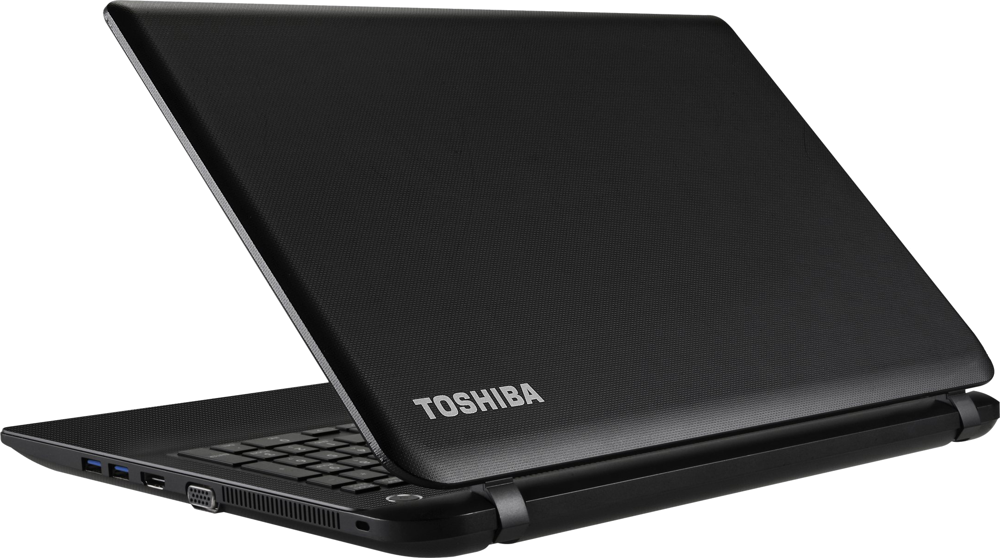

# Home Server

Contains code, scripts, configurations, and service definitions that I use on my home server.

## Background

### What I Use My Server For

I'm mostly using my server to self-host my own services via the Web/HTTP. The main ones being:

- My website
- Vaultwarden - My password manager
- Gitea - For local CI/CD and Git repo ownership
- Syncthing - For file backups
- File Browser - For network-based and remote file access

It's also a good opportunity to work with Linux, networking, and other computer nerd stuff.

## Setup

### Docker

I try to keep my services and software dockerized wherever possible, mostly managing them with Docker Compose files via the terminal. You can find the files in question under the [services](services) folder.

### Gitea

The nice thing about self-hosting a Gitea instance is that I can run basic CI/CD locally on my machines and deploy locally using [Gitea Actions](https://docs.gitea.com/usage/actions/overview). I'm namely doing this with my [website](https://nicolldouglas.xyz).

I have a job runner set up on my main PC used to run CI/CD jobs received from Gitea. This is mainly to offload heavy CI/CD processes from my server onto my PC which can handle them much better. But since everything is built locally I can just deploy straight away without much hassle.

### Nginx

I'm running a dockerized Nginx reverse proxy as a solution for hosting multiple services.

### Cloudflare Tunnel

Because I'm lazy and technology exists, I'm using a Cloudflare tunnel in order to expose my Nginx reverse proxy to the Web with minimal headache. Requests to my configured domains are piped into the tunnel in order for Nginx to do its thing. You can read more about that [here](https://developers.cloudflare.com/cloudflare-one/connections/connect-networks/). Cloudflare also conveniently provides a Docker image for running the Cloudflare daemon on your server.

It's a solid solution without having to expose your IP address and set up things like port-forwarding, DDoS protection, TLS, etc. since you get all of that out of the box. The only downside to this is being tied to the Cloudflare ecosystem but that's alright.

## Specifications

### OS

The operating system of choice is Debian 12. Mostly because I'm most comfortable with Ubuntu and I needed something more lightweight so my hardware doesn't suffer.

### Hardware

My server recycles an old Toshiba Satellite C50-B 14D laptop from circa 2014-15. I think originally this laptop was designed to run Windows 8 but when I dug it up it had Windows 10 installed. At that point it was basically unusable as a desktop but now it runs well with Linux instead.

#### Specifications

I have to be wary when trying to host certain services since my resources can be easily overloaded but for the most part the specs of the laptop can handle hosting simple web services which is all I need for now.

- Storage: 500GB HDD (SATA)
- Memory: 4GB
- CPU: Intel Celeron N2830
- Clock Speed: 2.16GHz

#### Images

  
  

## Roadmap

Some overdue things I'm needing to implement with my server:

- Easy log management
- Resource monitoring
- Perhaps a mail suite/server as well

Other than that, I think my main goal with the server is to try and experiment a bit more with different technologies and upskill in the sysadmin and devOps crafts.

Perhaps I might buy a cheap machine to try out working with things like Kubernetes and VMs, and leave the current one just for simple hosting. Or maybe I might just reinstall my entire setup and try learning something like Ansible as well as improving my Bash skills ¯\\\_(ツ)\_/¯.

